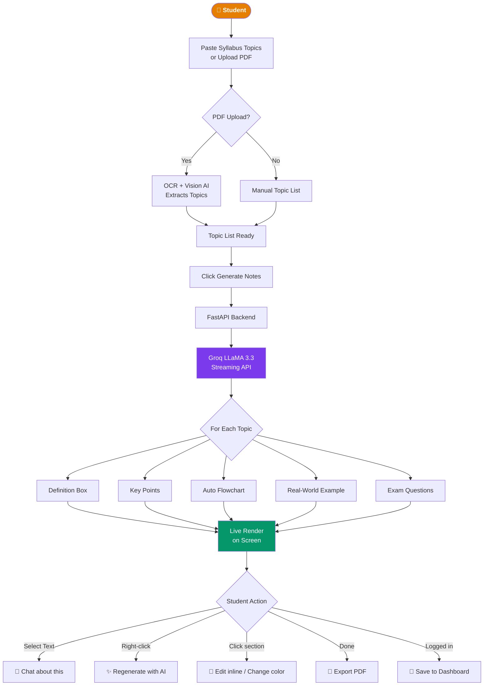
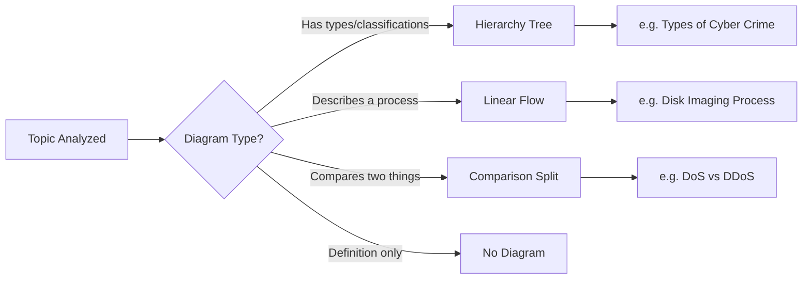
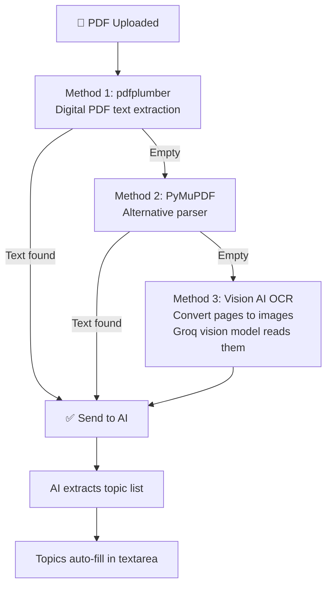
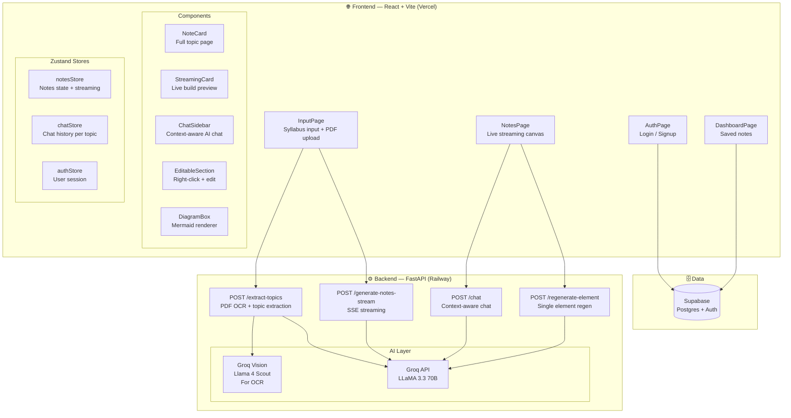

<div align="center">

# 📚 NoteGenAI

### AI-Powered Real-Time Notes Generator for B.Tech Students

[](https://notes-gen-ai-eight.vercel.app)
[](https://railway.app)
[](https://vercel.com)
[](LICENSE)

[](https://react.dev)
[](https://fastapi.tiangolo.com)
[](https://groq.com)
[](https://supabase.com)
[](https://tailwindcss.com)

---

> **Paste your syllabus. Watch your notes build in real time.**
>
> NoteGenAI generates structured, exam-ready B.Tech notes live — with auto flowcharts, AI chat, inline editing, and PDF export. Built for AKTU students, works for any university.

---

</div>

## ⚡ What Makes This Different

| Other Tools | NoteGenAI |
|---|---|
| Static notes PDFs | Notes build **live** in front of you |
| Generic AI answers | AI knows your **exact notes context** |
| Read-only output | **Click any element** to edit it |
| No visual structure | **Auto flowcharts** from topic content |
| Tab switching to ask AI | **Chat sidebar** inside the notes page |
| Type topics manually | **Upload syllabus PDF** — topics extracted automatically |

---

## 🎬 How It Works



---

## 🚀 Features

### 1. Real-Time Streaming Notes Generation
Notes appear **word by word** as the AI generates them — exactly like watching someone type. Each section (definition, key points, flowchart, example, exam questions) renders live as tokens stream from the API.

### 2. Auto Flowcharts
AI detects the type of diagram needed per topic and generates it automatically:



### 3. Context-Aware AI Chat Sidebar
Select any text in your notes → **"💬 Chat about this"** popup appears → sidebar opens with the AI already knowing your topic, subject, definition, examples, and key points. Ask anything — AI answers specifically about your notes, not generically.

### 4. Click to Edit Everything
Every element on every notes page is independently editable:
- **Click text** → inline editor opens
- **Right-click any section** → context menu appears
- **Regenerate with AI** → type an instruction → that element updates, everything else stays
- **Change Color** → color picker with presets → background changes instantly

### 5. PDF Syllabus Upload with OCR
Upload any syllabus PDF — even scanned ones. Three-method extraction:



### 6. User Accounts & Dashboard
- Sign up / Log in via Supabase Auth
- Save any generated notes to your account
- Dashboard shows all saved subjects with topic previews
- Open saved notes instantly — no regeneration needed

### 7. PDF Export
One click → browser print dialog → **background graphics preserved**, all colors intact, each topic on its own A4 page.

---

## 🏗️ Architecture



---

## 🛠️ Tech Stack

| Layer | Technology | Purpose |
|---|---|---|
| **Frontend** | React 19 + Vite | UI framework |
| **Styling** | Tailwind CSS 3 | Utility-first CSS |
| **State** | Zustand | Global state management |
| **Rich Text** | TipTap | Inline text editing |
| **Diagrams** | Mermaid.js | Auto flowchart rendering |
| **Color Picker** | react-colorful | Section color customization |
| **Backend** | Python FastAPI | REST + SSE streaming API |
| **AI** | Groq (LLaMA 3.3 70B) | Notes generation + chat |
| **Vision AI** | Groq (Llama 4 Scout) | PDF OCR |
| **PDF Reading** | pdfplumber + PyMuPDF | Text extraction |
| **Auth + DB** | Supabase | User accounts + note storage |
| **Frontend Host** | Vercel | Automatic deploys |
| **Backend Host** | Railway | Python API hosting |

---

## 📁 Project Structure

```
Notes-Gen-AI/
│
├── backend/                        # FastAPI Python backend
│   ├── models/
│   │   └── notes.py                # Pydantic data models
│   ├── routers/
│   │   └── notes.py                # All API endpoints
│   ├── services/
│   │   ├── generator.py            # Groq API calls + streaming
│   │   └── prompt.py               # All AI prompts
│   ├── main.py                     # FastAPI app entry point
│   ├── requirements.txt
│   └── Procfile                    # Railway deployment
│
└── frontend/                       # React frontend
    └── src/
        ├── components/
        │   ├── notes/
        │   │   ├── NoteCard.jsx    # Full topic page component
        │   │   ├── DiagramBox.jsx  # Mermaid flowchart renderer
        │   │   └── StreamingCard.jsx # Live build preview
        │   └── ui/
        │       ├── ChatSidebar.jsx      # AI chat panel
        │       ├── SelectionPopup.jsx   # Text selection popup
        │       ├── EditableSection.jsx  # Right-click wrapper
        │       ├── EditableText.jsx     # TipTap inline editor
        │       ├── RegeneratePopover.jsx # AI regen prompt box
        │       └── ColorPickerPopover.jsx # Color picker
        ├── pages/
        │   ├── InputPage.jsx       # Syllabus input + PDF upload
        │   ├── NotesPage.jsx       # Live streaming canvas
        │   ├── AuthPage.jsx        # Login / Signup
        │   └── DashboardPage.jsx   # Saved notes dashboard
        ├── store/
        │   ├── notesStore.js       # Notes + streaming state
        │   ├── chatStore.js        # Chat history per topic
        │   └── authStore.js        # User session
        ├── services/
        │   └── api.js              # All backend API calls
        ├── lib/
        │   └── supabase.js         # Supabase client
        └── utils/
            ├── mermaid.js          # diagram_data → Mermaid syntax
            └── exportPdf.js        # Browser print PDF export
```

---

## 🚀 Local Setup

### Prerequisites
- Python 3.10+
- Node.js 18+
- [Groq API key](https://console.groq.com) (free)
- [Supabase project](https://supabase.com) (free)

### Backend Setup

```bash
# Clone the repo
git clone https://github.com/maxprinceps/Notes-Gen-AI.git
cd Notes-Gen-AI/backend

# Create virtual environment
python -m venv .venv
.venv\Scripts\activate        # Windows
source .venv/bin/activate     # Mac/Linux

# Install dependencies
pip install -r requirements.txt

# Create .env file
echo "GROQ_API_KEY=your_key_here" > .env

# Start server
python main.py
# Server runs at http://localhost:8000
```

### Frontend Setup

```bash
cd ../frontend

# Install dependencies
npm install

# Create .env file
echo "VITE_API_URL=http://localhost:8000/api" > .env

# Start dev server
npm run dev
# App runs at http://localhost:5173
```

### Supabase Setup

Run this SQL in your Supabase SQL editor:

```sql
create table notes (
  id uuid default gen_random_uuid() primary key,
  user_id uuid references auth.users(id) on delete cascade,
  subject text not null,
  topics jsonb not null,
  notes_data jsonb not null,
  created_at timestamp with time zone default now(),
  updated_at timestamp with time zone default now()
);

alter table notes enable row level security;

create policy "Users can manage their own notes"
  on notes for all
  using (auth.uid() = user_id);
```

---

## 📡 API Reference

| Method | Endpoint | Description |
|---|---|---|
| `GET` | `/api/health` | Health check |
| `POST` | `/api/generate-notes-stream` | SSE stream — generates all topics live |
| `POST` | `/api/regenerate-element` | Regenerates one specific note element |
| `POST` | `/api/chat` | Context-aware AI chat (streaming) |
| `POST` | `/api/extract-topics` | PDF upload → OCR → topic extraction |

### SSE Stream Event Format

```json
{"event": "topic_start", "topic": "Cyber Crime", "index": 0, "total": 5}
{"event": "token", "text": "{\"definition\":"}
{"event": "topic_end", "topic": "Cyber Crime", "index": 0}
{"event": "done"}
```

---

## 🎓 Built For

- **B.Tech students** across AKTU, VTU, JNTU, and other Indian universities
- **Subjects covered:** Any — CS, IT, ECE, Mechanical, Civil
- **Exam patterns:** 2-mark short answers and 7-mark long answers generated automatically
- **University-specific examples:** Indian context in all analogies and examples

---

## 🗺️ Roadmap

- [x] Real-time streaming notes generation
- [x] Auto flowcharts (hierarchy / process / comparison)
- [x] Inline text editing with TipTap
- [x] AI regeneration per section
- [x] Color customization
- [x] PDF export
- [x] Context-aware AI chat sidebar
- [x] Text selection → chat popup
- [x] Exam question → full AI answer
- [x] PDF syllabus upload with OCR
- [x] User accounts + save notes
- [ ] PPT export (portrait slides)
- [ ] Multilingual mode (Hindi / Hinglish)
- [ ] Exam simulator with AI grading
- [ ] Mobile app

---

## 👥 Authors

Built by two final-year B.Tech students who were tired of making notes the night before exams.

**Prince** — [@maxprinceps](https://github.com/maxprinceps)

---

## 📄 License

MIT License — use it, fork it, build on it.

---

<div align="center">

**If this saved you from an all-nighter, give it a ⭐**

[🚀 Try it live](https://notes-gen-ai-eight.vercel.app) • [🐛 Report a bug](https://github.com/maxprinceps/Notes-Gen-AI/issues) • [💡 Request a feature](https://github.com/maxprinceps/Notes-Gen-AI/issues)

</div>